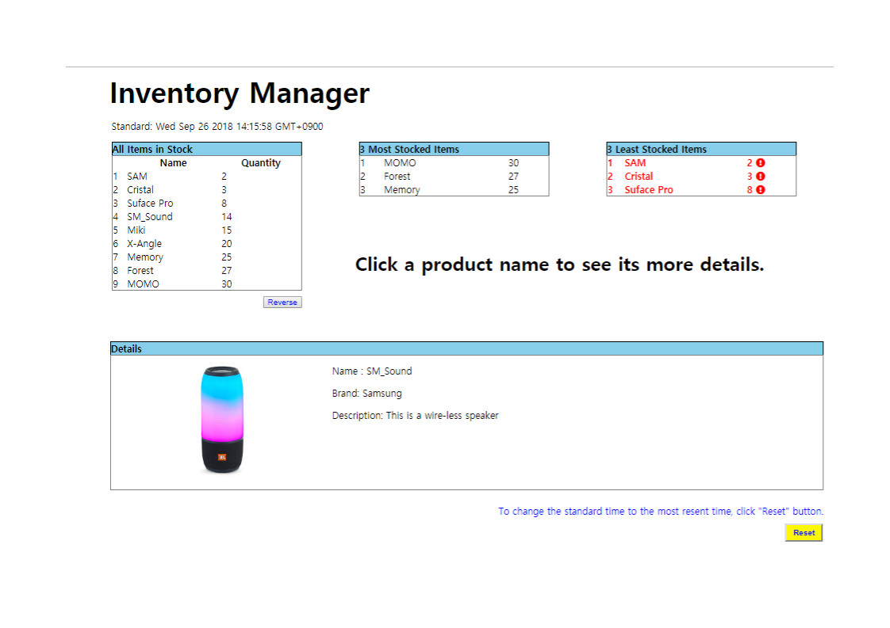

<h1>Inventory manager</h1>

<h4>A simple application for stock management.</h4>

   

<h3>Functionalities</h3>

<h4>1. List of all items(List_01) and "reversing the order" functionality </h4> 
   The list of all items arranged by quantity by default. 
   But, by clicking "Reverse" button, a user can reverse the order of the items. 
  

<h4>2. Lists of the 3 most stocked items and the 3 least stocked items(List_02, List_03)</h4> 
  The lack of particular items can be a very important issue to manage stocks. 
  In the 3 least stocked item list, items are listed with a warning sign. 
  
<h4>3. Detail box</h4> 
  When a user clicks the name of any item in any list,  
  the user can read the information about the item.  
  
<h4>4. Reseting the data to the latest one</h4> 
  All data for every lists are provided based on "Standard time"(on the top of the page). 
  "Standard time" is set to the time when a user came to the page at first by default. 
  However, If a user resets "Standard time" by clicking "Reset" button, the data in the app will be updated by the latest data.  

 
